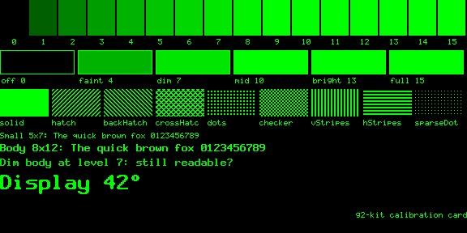
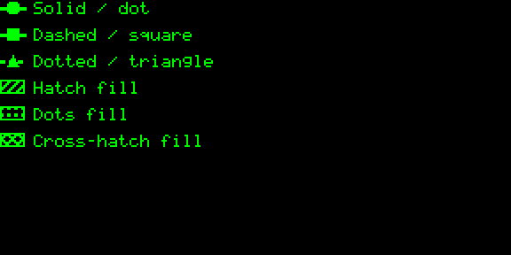
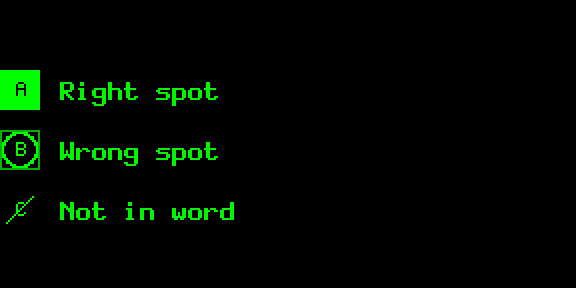

# DESIGN

Rules for drawing on a 576×288, 4-bit, green, see-through display. Every g2-kit component follows them;
apps drawing their own tiles should too.

## 1. Levels: sixteen values, a handful of steps

The glasses show 16 grey levels (0–15) as green light. Level 0 is off, which on a see-through display means
*transparent*. Sixteen levels are not sixteen colours.

### What we measured

`examples/hub-ramp` sends a 256-step 8-bit ramp, raw Gray8 and packed Gray4 to **evenhub-simulator 0.9.5**
and reads the glasses framebuffer back through the automation API:

- The host's 8-bit → gray4 conversion is linear: value *v* becomes level `round(v / 17)`. g2-kit encodes
  level *L* as `L × 17`, so every level lands exactly.
- The simulator then displays level *L* with brightness ≈ `min(1, L/9)^0.45`:

| Level | 0 | 1 | 2 | 3 | 4 | 5 | 6 | 7 | 8 | 9–15 |
|---|---|---|---|---|---|---|---|---|---|---|
| Simulator brightness | 0 % | 38 % | 51 % | 62 % | 70 % | 77 % | 84 % | 90 % | 96 % | 100 % |

So on the simulator, **levels 9–15 look identical**, and levels 1–8 are spread over the top 60 %.
**On real G2 glasses** (2026-09-29, `hub-calibrate` sideloaded by QR, checked by eye) the response has the
same shape: brightness levels off around 8–10, level 1 is still visible, and the six default theme swatches
(0/2/4/6/8/15) are all distinct. This was a visual check, not a photometric measurement.



### Named levels

Components never use raw numbers. They ask the `Theme` for a named level:

| Name | Default | Simulator | Linear display | Use for |
|---|---|---|---|---|
| `off` | 0 | 0 % | 0 % | background (transparent) |
| `faint` | 2 | 51 % | 13 % | tracks, unlit 7-seg segments, disabled, frames of unfocused panels |
| `dim` | 4 | 70 % | 27 % | axes, secondary marks, far neighbours |
| `mid` | 6 | 84 % | 40 % | secondary data, inactive controls, labels |
| `bright` | 8 | 96 % | 53 % | primary data and text |
| `full` | 15 | 100 % | 100 % | focus, highlights, headline numbers |

The defaults were picked against the measured simulator curve and confirmed distinct on G2 glasses. Keep
the bright end at or below ~9 for anything that must differ from `full`. `linearTheme` (4/7/10/13/15) is
for a display that renders levels linearly; on G2 its top three levels look the same. To retune (e.g. for
sunlight or another device), run `examples/hub-calibrate` and override:

```ts
import { createTheme } from 'g2-kit/core'
const theme = createTheme({ levels: { faint: 3, dim: 5 } })
const g2 = await connect({ theme })
```

`encodePreviewPng(fb, { curve: SIMULATOR_CURVE })` renders previews the way the simulator shows them; the
gallery uses it.

## 2. Meaning by shape, not brightness

Brightness alone is not reliable (the step between two levels may vanish on a device, in sunlight, or on the
simulator). Every distinction g2-kit draws has a shape difference too:

- **Marks** (WordLens's rule): filled = yes / right spot, ring = partly / wrong spot, strike = no.
  Used by `GridBoard`, `StatusKeyboard` and `Legend`.
- **Negative bars** are outlines; positive bars are filled (with the outline surface: framed with sparse
  dots, so negatives stay the empty frames).
- **Focus** is a 2 px outline (plus corner ticks on buttons), never only a brighter fill.
- **Toggle**: off = hollow track with a hollow knob on the left; on = filled track, knob on the right (outline
  surface: lit frame, solid knob on the right).
- **Selected** (active button, selected segment or boxed tab) is a solid block, or a double frame with the
  outline surface.
- **Delta arrows**: filled when the change is good, outlined when bad (`good: 'up' | 'down'`).
- **Toasts**: info = frame, success = double frame, warning = dashed frame, error = inverted.
- **Heatmaps** can encode the value twice: level *and* square size (`encoding: 'both'`).

### The series encoding library

Each series index gets a dash, a marker and a fill pattern (`seriesStyle(i)`), used by every chart:

| Series | Dash | Marker | Fill |
|---|---|---|---|
| 0 | solid | dot | solid |
| 1 | dashed | square | hatch ╱ |
| 2 | dotted | triangle | dots |
| 3 | dash-dot | diamond | cross-hatch |
| 4 | long-dash | cross | checker |
| 5 | solid | ring | vertical stripes |

Charts warn (once) above three series: more than that is hard to separate on the glasses. Patterns are
anchored to absolute pixel coordinates, so neighbouring shapes line up, and every pattern has ≥ 2 px runs.
`renderLegend` draws a key for any mix of paints, dashes, markers and marks.

 

## 3. Strokes, grids, labels

- Data strokes are ≥ 2 px (`theme.stroke`). 1 px lines are only used for frames and tick marks.
- No hairline gridlines. Charts draw a 2 px baseline and short tick marks at the edge.
- Label density is `'sparse'` by default: first, last and highlighted category; min and max on the y axis.
  `'normal'` shows all, `'none'` hides them.
- Labels never sit on data: value labels go above bars (below for negatives), annotations are clamped
  inside the plot and flipped rather than overlapping axis labels.
- Generous padding (`theme.padding`, 6 px) around every component.
- Empty, loading and error states replace the chart with a message (`state`, `message`).

## 4. Fonts

| Font | Glyph | Advance | Use |
|---|---|---|---|
| `font5x7` | 5×7, 1 px strokes, full ASCII incl. lowercase | 6 | tiny labels at 1×, WordLens-style text at 2× |
| `font8x12` | 7×12, 2 px vertical stems (VGA style), cap height 9 | 8 | body text and values |
| `font16x24` | 14×24, Scale2x of the body font (smooth diagonals) | 16 | headlines, big numbers |
| 7-segment | any height, parametric | fixed | clocks, counters, KPI (`style: 'segment'`) |

All fonts are monospaced, so updating numbers never shifts the layout. Text helpers: `drawText` (align),
`ellipsize`, `wrapText`, `drawTextBox` (wrap, max lines, ellipsis, vertical align) and `fitText` (largest
font that fits).

## 5. Dithering

Off by default: ordered dither shimmers on this display. `fromRGBA(..., { dither: 'bayer4' })` exists for
photos only.

## 6. The squint test

Render at 1:1, look at it in the simulator (or the gallery preview), and if you can't read it at a glance, it
fails. The gallery's contact sheet exists for this.

### Ink

Level 0 is see-through; every lit pixel sits between the wearer and the world. `inkRatio(fb)` is the share
of lit pixels. The gallery captions, the contact sheet and `npm run bench` show it per sample, and a test fails
when a sample goes over `INK_BUDGET` (25 %) without a listed reason (test/components.test.ts). Allowed
exceptions are fills that carry the data or a meaning (heatmap cells, waffle, filled marks, held dice) and
small rects that a solid badge or bar fills.

`theme.surface: 'outline'` (`outlineTheme`) trades solid blocks for frames: positive bars and histogram bins
become frames with sparse dots (the highlighted bar and the marked bin stay solid, so they still stand
out), active buttons and selected segments or tabs get a double frame, toggles a lit frame with a solid
knob, progress fills a hatch with a solid leading edge, and error toasts a frame with only the icon inverted.
A pressed button stays solid (it is a brief flash). Components call `drawBlock` for this; it returns whether
the block came out solid, so content on it is punched out (level 0) or drawn lit. Across the 13 samples that
change, ink drops from 30 % to 14 %; `npm run gallery` writes `surface-sheet.png` with both side by side.

Trade-off, measured on the glasses: the outline bar chart sends ~10 % *slower* than the filled one (570 vs
520 ms), because frames and sparse dots are more detail than solid bars. `surfaceTexture: false` drops the dots
and hatches (plain frames): measured, that makes outline progress bars as fast as filled ones (260 ms), but
outline bar charts stay ~10 % slower either way, since the frames are the extra detail. Choose outline for
see-through, filled for update speed; a screen that updates on every swipe may be better filled.

## 7. Recommended sizes

Every component accepts any rect; these are the sizes they are designed and tested at (the default for
`renderToTile`). A full image tile is 288×144.

| Component | Size | Component | Size |
|---|---|---|---|
| BarChart, LineChart, MultiBarChart | 288×144 | Carousel | 288×64 |
| PieChart, ProgressRings | 288×144 | Button / ButtonRow | 96×32 / 288×44 |
| Heatmap, CalendarHeatmap | 288×144 | Toggle | 160×36 |
| Funnel, Legend | 288×144 | SegmentedControl | 288×36 |
| Kpi, Gauge | 288×144 (144×144 ok) | Slider | 288×56 (72×144 vertical) |
| Sparkline | 96×24 (16–32 px tall) | Roller | 288×96 |
| BulletChart | 288×36 | TimePicker, DatePicker | 288×120 |
| Timeline | 288×96 | Checklist, GridKeyboard | 288×144 |
| BigText, Modal, HudFrame | 288×144 | StatusKeyboard | 288×120 |
| ProgressBar | 260×40 | Toast | 288×48 |
| Tabs, Ticker | 288×24 | StatusBar | 288×20 |
| PaginationDots | 96×16 | ScrollIndicator | 6×144 |
| AnalogClock, TimerRing | 144×144 | CompassStrip | 288×48 |
| TurnArrow | 288×96 | GridBoard | 144×144 |
| ScoreHud | 288×24 | Keyboard | 288×144 (576×144 symbols beside, 288×288 below) |

## 8. Gesture convention

| Gesture | Default action |
|---|---|
| Swipe down / up | next / previous (focus, or value in edit mode) |
| Tap | activate; enter or commit edit mode |
| Hold | secondary action / back; cancel edit mode |
| Double-tap | app level: the system exit prompt (`shutDownPageContainer(1)`) |

See [INPUT.md](INPUT.md).

## 9. Prefer one layout, change pixels

Switching views by redrawing tiles inside one layout is cheaper and safer than rebuilding the page:
rebuilds flicker on hardware, and on G2 glasses a rebuild to four full-size images has been seen to leave the
right lens without images (STATUS.md). `G2.show()` skips the rebuild when the new page has exactly the same
containers as the one on screen, so showing the same layout again is free. The full-screen layout's four tiles
can host a 2×2 dashboard, one chart spanning all four, a keyboard, or a board without ever rebuilding.

## 10. Frame budget

Each image send takes **~300–370 ms** on G2 glasses (measured with `hub-bench`; ~450 ms for a tile full of
patterns), so a screen gets 2–3 image updates per second, and sends never overlap. Design so that one gesture changes one tile: put the
thing that reacts to swipes (a carousel, a cursor) on its own tile, and let `G2`/`Surface` skip tiles whose
pixels did not change. A gesture that changes two tiles takes ~0.7 s to show. A ticker or spinner costs one
send per frame (2–3 frames/s at best); use them sparingly.

What a send costs (measured, STATUS.md): **~200 ms fixed per send**, plus time for detail. A blank tile takes
~200 ms, a big counter ~350 ms, a detailed chart or a hatched area ~500–550 ms. Bytes and image format barely
matter; edges and texture do (the SDK compresses the picture). So: fewer sends first, then fewer edges.
Solid areas are cheap; patterns, hatching and dithering are the most expensive thing you can draw.

Cheapest of all is no image: updating a firmware text container (`G2.setText`) took ~60 ms on the glasses vs
~260 ms for the same progress drawn on a tile (10 vs 3.5 updates/s). Put fast-changing readouts (progress,
counters, status lines) in text when the firmware font is good enough.
