# g2-kit

Drawn UI for **Even Realities G2** Hub plugins: charts, controls, HUD chrome and game pieces that the
firmware doesn't provide, rendered on the phone into 4-bit greyscale image tiles and pushed to the glasses.

> Unofficial community package. Not affiliated with or endorsed by Even Realities.

**[Live demo and full gallery →](https://razkom.github.io/g2-kit/)** Every component with its props, plus the
example apps running in your browser (on-screen gesture buttons stand in for the touchpad).

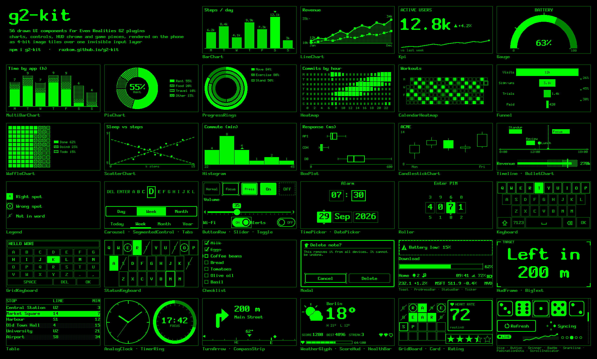

## What's in the box

56 components, each a pure function of its props (`X.render(fb, rect, props)`, `X.renderToTile(props)`) plus 56 icons.

| Category | Import | Components |
|---|---|---|
| **Charts** (19) | `g2-kit/charts` | `BarChart` · `LineChart` · `Sparkline` · `Kpi` · `Gauge` · `MultiBarChart` (grouped / stacked) · `PieChart` (pie / donut) · `ProgressRings` · `Heatmap` · `CalendarHeatmap` · `Funnel` · `BulletChart` · `Timeline` · `WaffleChart` · `ScatterChart` · `Histogram` · `BoxPlot` · `CandlestickChart` · `Legend` |
| **Input controls** (14) | `g2-kit/widgets` | `Keyboard` (QWERTY / QWERTZ / AZERTY / ABC, configurable, see below) · `Carousel` · `Button` · `ButtonRow` · `Toggle` · `SegmentedControl` · `Slider` · `Roller` · `TimePicker` · `DatePicker` · `Checklist` · `StatusKeyboard` · `GridKeyboard` (ABC / T9) · `Rating` |
| **Text, feedback & chrome** (14) | `g2-kit/widgets` | `BigText` · `ProgressBar` · `Toast` · `Modal` · `Tabs` · `PaginationDots` · `ScrollIndicator` · `StatusBar` · `HudFrame` · `Ticker` · `Table` · `Card` · `Badge` · `Spinner` |
| **Data faces** (5) | `g2-kit/widgets` | `AnalogClock` · `TimerRing` · `CompassStrip` · `TurnArrow` · `WeatherGlyph` |
| **Text components** (10) | `g2-kit/widgets` | `TextSpinner` · `TextProgress` · `TextSlider` · `TextMenu` · `TextToggle` · `TextHold` · `TextToast` · `TextStatusLine` · `TextReadout` · `TextTicker`: strings for firmware text containers, no image send (see below) |
| **Game kit** (4) | `g2-kit/widgets` | `GridBoard` (word games, Sudoku, 2048, tic-tac-toe) · `ScoreHud` · `Dice` · `HealthBar`, plus `SpriteSheet` / `drawSprite` |
| **Icons** (56) | `g2-kit/icons` | Vector icons for 8 / 12 / 16 px, incl. 10 weather conditions |
| **Layouts** (9) | `g2-kit/bridge` | `textBoxes` · `twoTilesWithList` · `twoTilesWithControl` · `dashboardQuad` · `heroSidebar` · `fullScreen` · `menuPage` · `textWithTile` · `textWithSpan` |
| **Input** | `g2-kit/input` | `blankTextSkeleton` · `listSkeleton` · `PagedList` · `HybridSkeleton` · `FocusRing` (with edit mode) · `TapConfirm` · `HoldToConfirm` · `promptText` (one-call text entry) |

Previews use the brightness curve measured in evenhub-simulator 0.9.5, which matched G2 glasses by eye.

### Less ink: the outline surface

Every lit pixel sits between the wearer and the world. `inkRatio(fb)` measures the share of lit pixels; the
gallery and `npm run bench` show it per sample, and a test flags samples over `INK_BUDGET` (25 %).
`createTheme({ surface: 'outline' })` (or `outlineTheme`) makes bars, active buttons, toggles, selected
segments and tabs, progress fills and error toasts draw frames and light textures instead of solid blocks:
ink across those samples drops from 30 % to 14 %. The gallery shows filled and outline side by side.

```ts
import { outlineTheme } from 'g2-kit/core'
const g2 = await connect({ theme: outlineTheme })
```

### Keyboard

One gesture axis means a keyboard is a question of what a swipe walks through. `keyboardLayout(options)` compiles
letters (`'qwerty'`, `'qwertz'`, `'azerty'`, `'abc'` or your own rows), digits (a row above the letters, in the
symbols set, or none), extra punctuation on the letter row, a symbols set (a second layer behind `?123`, a panel
beside the letters on two tiles, or below them), the action row (`shift`, `caps`, `symbols`, `space`, `delete`,
`submit`, `cancel`, in any order, with labels) and the scan (`rows`, `columns` or every key in one line).
Swipe picks a row, tap opens it, swipe picks a key, tap types and returns to the rows; hold goes back.

```ts
import { promptText } from 'g2-kit/input'
const text = await promptText(g2, { keyboard: { letters: 'azerty', panels: 'side', labels: { submit: 'Send' } } })
```

`typingCost(layout, text)` counts the fewest gestures a text needs, to compare configurations. On short messages:
rows ≈ 5.1 gestures per character, columns ≈ 5.5, one line of keys ≈ 9.4; ABC rows ≈ 4.8. `KeyboardState` is the
headless state machine if you draw your own page. Try every option with `npm run dev:keyboard`.

### Text components

A firmware text update took ~60 ms on G2 glasses vs ~260 ms for an image send (STATUS.md), so readouts that
change often can be text instead of pixels. Text components render props to a string; `g2.textArea(container)`
shows them, composing slots and sending only when the text changed. Inline, in the page's existing text:

```ts
const status = g2.textArea(page.text)
status.layout((p) => `${p.spin} ${p.title}\n${p.bar}`)
status.set('title', 'Syncing').draw('spin', TextSpinner, { frame }).draw('bar', TextProgress, { value: 0.4 })
```

Or one per container, e.g. a settings page of sliders with `layouts.textBoxes`. Keep each box to the lines it
fits (~27 px per line plus padding): an overflowing box scrolls, and the capture box then eats swipes.

The firmware font has no grey levels or sizes and is proportional, but it draws box drawing, blocks and shapes, so
the components look drawn: `Download ━━━━━━━━──────────── 40%`, `▶ Volume ━━━━●─────── 40`, `▶ Wi-Fi  ● On`,
`▲ Battery low`, `Heart rate  128 bpm  ↑ +4`. For live values over a picture, draw the picture on a tile once
and put the numbers in a text box: each update then costs ~60 ms instead of a tile send. For hold-to-confirm,
`TextHold` felt far more reactive on the glasses than an image ring.
`glyphs: 'ascii'` falls back to `[####----]`. `unsupportedTextChars(text)` lists characters the glasses can't draw
(emoji, `…`, `•`), and `g2.textArea` warns about them. Try it with `npm run dev:text`.

### Running in the simulator

| Dashboard: swipe moves focus | Tap: one chart across 4 tiles | Carousel typing |
|---|---|---|
| 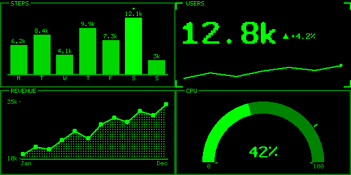 | 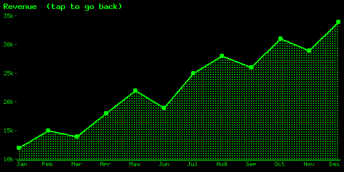 | 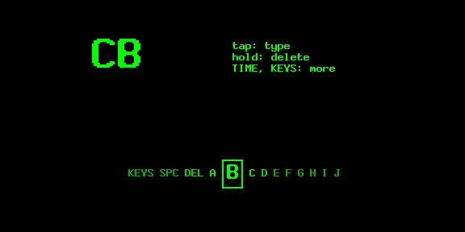 |
| **Time picker in edit mode** | **Keyboard tile + firmware text** | **Tic-tac-toe** |
| 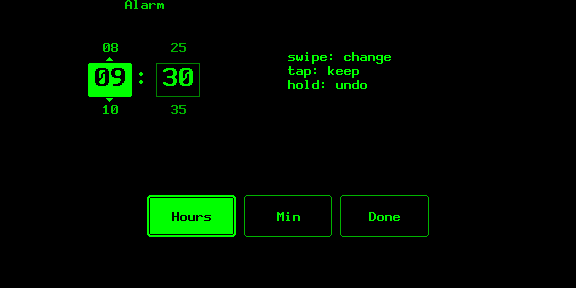 | 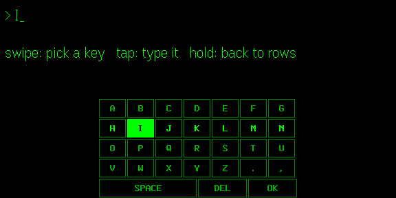 | 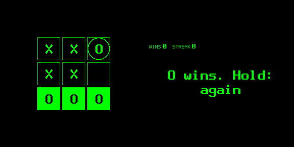 |
| **Text components inline (no image sends)** | **A text slider per text box** | **Keyboard, symbols beside (2 tiles)** |
| 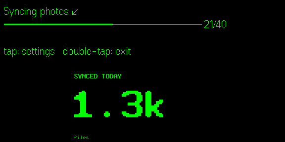 | 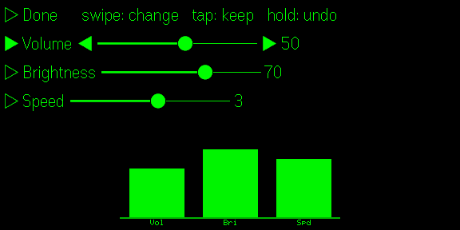 | 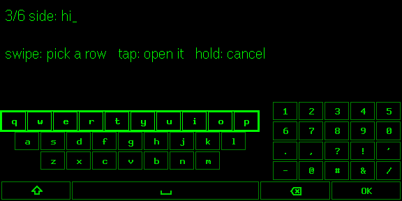 |
| **Live text boxes over a slow chart tile** | | |
| 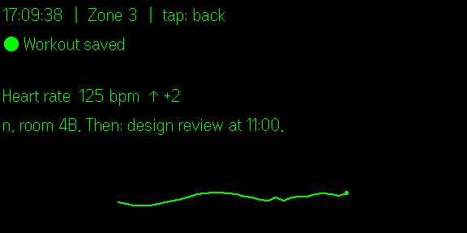 | | |

## The idea: skeleton input + image UI

A G2 page can have up to 4 image containers and 8 text/list containers, but exactly **one** container
captures input, and image containers are not interactive. So g2-kit splits every screen in three:

```
            what you see                          what you touch
 ┌────────────────────────────────┐     ┌────────────────────────────────┐
 │ SURFACE: ≤ 4 image tiles       │     │ SKELETON: one capturing text   │
 │ (≤ 288×144 each), drawn on the │ over│ container with content ' '     │
 │ phone into 4-bit framebuffers  │     │ (or a native list)             │
 └───────────────┬────────────────┘     └───────────────┬────────────────┘
                 │ changed tiles only                   │ swipe / tap / double-tap / hold / select
                 │ (~350 ms per send)                   ▼
        ┌────────┴─────────────────────────────────────────────┐
        │ CONTROLLER (your code + FocusRing): event → state →  │
        │ component props → redraw only the tiles that changed │
        └──────────────────────────────────────────────────────┘
```

- **Skeleton**: a real but invisible container that captures gestures, placed under the images.
- **Surface**: up to four tiles; components render into them and only tiles whose pixels changed are sent.
- **Controller**: normalised events drive state; a redraw costs one send per changed tile, so aim for one tile per gesture.

## Quickstart

```bash
npm i g2-kit @evenrealities/even_hub_sdk
```

```ts
import { connect, layouts } from 'g2-kit/bridge'
import { BarChart, Kpi } from 'g2-kit/charts'

const data = await (await fetch('https://example.com/stats.json')).json()
const g2 = await connect() // waits for the Even App bridge

const page = layouts.twoTilesWithList({ items: ['Refresh', 'Details', 'Exit'] })
await g2.show(page) // creates the page; pixels are sent after it resolves

g2.draw('left', BarChart, { title: 'Steps', data: data.days, format: 'compact' })
g2.draw('right', Kpi, { label: 'Today', value: data.today, delta: data.delta, deltaFormat: 'percent' })

g2.on('select', (e) => {
  const item = page.capture.items![e.index]
  if (item === 'Exit') void g2.exit() // system exit prompt
})
```

No quantisation, framebuffer, PNG or send-locking code: `g2.draw` renders, diffs and queues; the
`ImageQueue` serialises and coalesces sends. Double-tap shows the exit prompt by default.

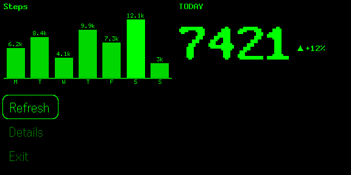

## Packages

| Import | What |
|---|---|
| `g2-kit/core` | `Framebuffer`, named levels and `Theme` (incl. the `outline` surface), `inkRatio`, primitives (lines with dashes, arcs, sectors, polygons, pattern fills, round rects), 3 bitmap fonts + 7-segment digits, text layout (align, wrap, ellipsis, auto-fit), PNG / Gray8 / packed Gray4 encoders, `CanvasAdapter`, tile spanning. No DOM, no deps. |
| `g2-kit/bridge` | `connect()` / `G2` (incl. `g2.modal()` to hand gestures to a prompt), `ImageQueue` (serial, coalescing, rebuild-aware, typed errors), `PageBuilder` (validated layouts), 9 `layouts` presets, `g2.textArea()`, event normaliser, retained `Surface`. The SDK is a peer dependency, imported only inside `connect()`. |
| `g2-kit/input` | Skeleton presets, `PagedList` (> 20 items through a native list), `HybridSkeleton`, `FocusRing` with edit mode, `HoldToConfirm`, `TapConfirm`, `promptText` (`const name = await promptText(g2, { label: 'Name' })`: keyboard page, resolves the text or null). |
| `g2-kit/charts` | Bar, line, sparkline, KPI, gauge, grouped/stacked bars, pie/donut, progress rings, heatmap, calendar heatmap, funnel, bullet, timeline, legend; waffle, scatter, histogram, box plot, candlestick. |
| `g2-kit/widgets` | Configurable keyboard (`keyboardLayout`, `KeyboardState`, `typingCost`); text components (`TextSpinner`, `TextProgress`, `TextSlider`, `TextMenu`, `TextToggle`, `TextHold`, `TextToast`, `TextStatusLine`, `TextReadout`, `TextTicker`); carousel, buttons, toggle, segmented, slider, roller, time/date pickers, checklist, status and grid keyboards, progress, big text, toast, modal, tabs, dots, scroll indicator, status bar, HUD frame, ticker, clock, timer ring, compass, turn arrow, grid board, score HUD; table, card, badge, spinner, weather glyph, rating, dice, health bar, sprite sheets. |
| `g2-kit/icons` | 56 vector icons tuned for 8, 12 and 16 px, incl. 10 weather conditions. |

Every component has the same contract and is a pure function of its props:

```ts
Component.render(fb, rect, props, theme?)     // into any rect of any framebuffer (clipped)
Component.renderToTile(props, size?, theme?)  // convenience: a fresh tile
```

## Platform constraints (what g2-kit enforces)

| Rule | Value | Source |
|---|---|---|
| Canvas | 576×288, 16 grey levels shown green | docs |
| Containers per page | ≤ 4 image + ≤ 8 text/list, 1–12 total | docs, SDK |
| Image size | 20–288 × 20–144 px | SDK d.ts |
| Input capture | exactly one `isEventCapture: 1` | docs, SDK |
| `zOrderIndex` | all or none, unique; larger = front | docs, SDK |
| Native list | ≤ 20 items, ≤ 63 UTF-8 bytes each | docs (64 chars), simulator (63 bytes) |
| Text content | ≤ 999 UTF-8 bytes on create/rebuild | docs (1000 chars), simulator (999 bytes) |
| Menu | ≤ 10 items, non-zero unique IDs, names ≤ 32 bytes; omitting it on rebuild clears it | SDK |
| Image sends | never concurrent; ~300–370 ms each on G2 (~450 ms for dense tiles) | measured (`hub-bench`) |
| Text updates | ~60 ms each on G2; ≤ 2000 characters | measured (`hub-bench`); community notes |
| Text font | one proportional firmware font; ASCII/Latin-1, arrows, box drawing, blocks, some shapes; no emoji | community notes (`unsupportedTextChars`) |

`PageBuilder` rejects violations with a `PageLayoutError` that names every broken rule, e.g.
`[IMAGE_SIZE] image 'chart': image is 300×144; must be 20–288 × 20–144 px`.

## Seeing the examples

Three ways, from least to most setup:

1. **In your browser, nothing to install:** the [demo site](https://razkom.github.io/g2-kit/). Each example
   runs against a mock host; the canvas shows exactly the frames that would be sent to the glasses.
2. **Locally, from a clone:**
   ```bash
   npm install
   npm run build:site && npm run preview:site   # gallery + demos at http://localhost:5190
   npm run dev:dashboard                        # or run one example with hot reload (add ?mock in a browser)
   ```
3. **In evenhub-simulator** (installed as a devDependency): start an example, then point the simulator at it:
   ```bash
   npm run dev:dashboard
   npm run sim -- http://localhost:5181
   ```
   `npm run sim:check -- hub-dashboard` does it headlessly through the simulator's automation API and saves
   glasses screenshots and the console to `examples/output/sim/`. On a phone, `evenhub qr --port 5181`
   sideloads the dev server.

| Example | What it shows | Dev server |
|---|---|---|
| `hub-quickstart` | The snippet above, over a native list | `npm run dev:quickstart` (5186) |
| `hub-dashboard` | Quad dashboard; swipe cycles focus (2 tile sends), tap opens a chart drawn across 4 tiles | `npm run dev:dashboard` (5181) |
| `hub-picker` | Carousel (1 tile per swipe), time picker with FocusRing edit mode, `promptText`: QWERTY `Keyboard` on one tile under a firmware text line | `npm run dev:picker` (5182) |
| `hub-game` | Tic-tac-toe: swipe walks empty cells, tap plays | `npm run dev:game` (5183) |
| `hub-calibrate` | Test card (16 levels, theme levels, patterns, fonts) for tuning a device | `npm run dev:calibrate` (5184) |
| `hub-lens` | Diagnostic for the one-lens-after-rebuild issue (see STATUS.md); record results per step on the phone | `npm run dev:lens` (5187) |
| `hub-bench` | Send benchmark: `updateImageRawData` round trip and frames/s, sweeping the gap, tile size, image format or tile content; results saved to the PC | `npm run dev:bench` (5188) |
| `hub-probe` | Hardware questions in one page: render time on the phone, swipe throughput, long-press timing (image ring vs `TextHold`); results saved to the PC | `npm run dev:probe` (5192) |
| `hub-text` | Text components: a spinner and progress bar inline in the page's text, then a settings page with a `TextSlider` per text box | `npm run dev:text` (5191) |
| `hub-keyboard` | Every `Keyboard` option: pick a configuration on the phone, type on the glasses; hold switches preset, the page counts gestures per message against `typingCost` | `npm run dev:keyboard` (5189) |

`npm run gallery` renders every component to `examples/output/` (PNG per sample, `index.html`,
`contact-sheet.png`); `npm run docs:images` regenerates the images in this README.

## Troubleshooting

- **Page stuck connecting in a Vite dev server**, with `Failed to fetch dynamically imported module …even_hub_sdk…`
  (HTTP 504) in the console: Vite discovered the SDK at runtime. Add
  `optimizeDeps: { include: ['@evenrealities/even_hub_sdk'] }` to `vite.config.ts`, or import the SDK
  yourself and pass it in: `import * as sdk from '@evenrealities/even_hub_sdk'` then `connect({ sdk })`.
- **Images in only one lens after switching pages**: see "Known hardware issue" in STATUS.md. Prefer
  switching views inside one layout (`G2.show()` skips rebuilds for identical layouts); a glasses restart
  cleared it.

## Docs

- [DESIGN.md](DESIGN.md): greyscale rules, the measured brightness curve, the encoding library, fonts, recommended sizes.
- [INPUT.md](INPUT.md): skeletons, focus rings, edit mode, confirmation, the event truth table and what is unverified.
- [STATUS.md](STATUS.md): what is done and how each part was verified (unit / gallery / simulator / glasses).
- [NOTES.md](NOTES.md): what was taken from WordLens and what changed.
- [ROADMAP.md](ROADMAP.md): next steps, planned components and features.
- [AGENTS.md](AGENTS.md): conventions and commands for contributors and coding agents.

## Verification status in one paragraph

Everything is unit-tested in Node (276 tests: golden buffers, round-trips, queue ordering/coalescing,
layout validation, the event truth table, a smoke + PNG-hash snapshot per gallery sample, an ink budget, text
component output). All examples run in **evenhub-simulator 0.9.5**, driven through its automation API. On
**real G2 glasses**: the calibration card displays correctly (all six theme levels distinct, level 1 visible,
every font readable, brightness levelling off around 8–10 as in the simulator); image sends were measured
(~350 ms per tile, ~200 ms of it fixed, no failures in 900+ sends; png, png4, gray8 and gray4 all display);
text updates take ~60 ms; and the text components read well, glyphs included, with every swipe arriving. One
hardware issue is known: after a page rebuild to four full-size images, the right lens sometimes stayed empty
until the glasses restarted, so `G2.show()` avoids rebuilds it doesn't need. Long-press timing, swipe
throughput under load and phone render time are still open; see STATUS.md.

## Credits

The core pattern (4-bit framebuffer, 5×7 font, serial image queue, drawn carousel over a blank capturing
text container, shape-coded marks) comes from [WordLens](https://github.com/RAZKOM/WordLens).

MIT licensed.
