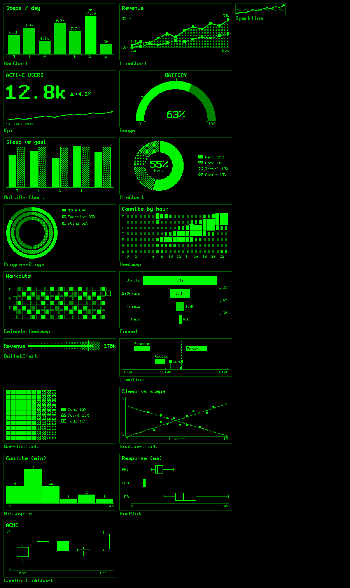
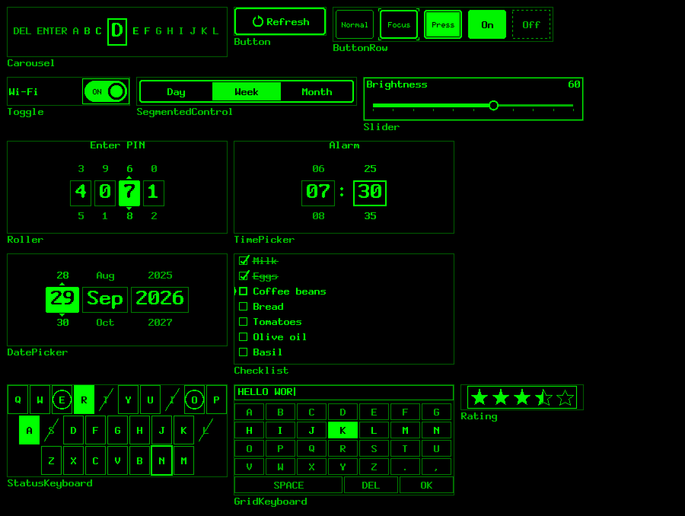
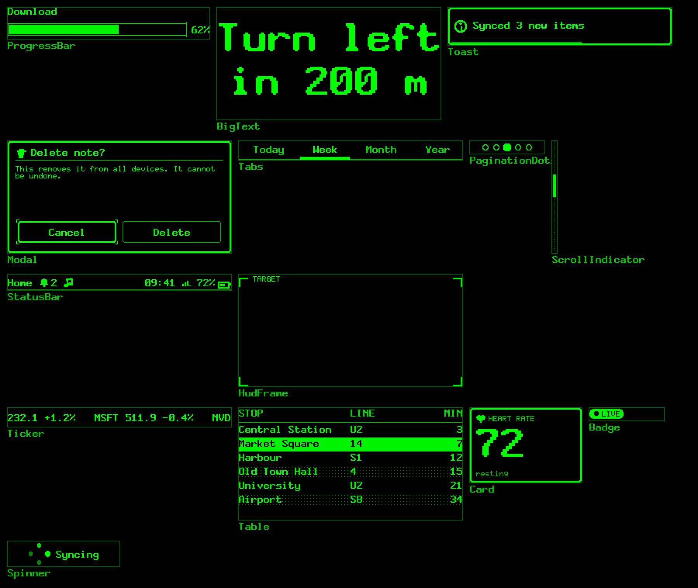
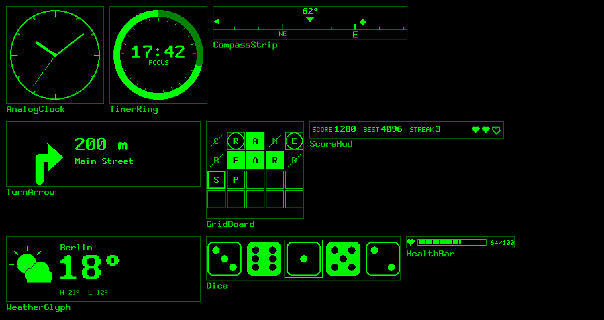

# g2-kit

Drawn UI for **Even Realities G2** Hub plugins: charts, controls, HUD chrome and game pieces that the
firmware doesn't provide, rendered on the phone into 4-bit greyscale image tiles and pushed to the glasses.

> Unofficial community package. Not affiliated with or endorsed by Even Realities.

**[Live demo and full gallery →](https://razkom.github.io/g2-kit/)** Every component with its props, plus the
example apps running in your browser (on-screen gesture buttons stand in for the touchpad).


## What's in the box

55 components, each a pure function of its props that draws into a 4-bit tile. Previews use the brightness
curve measured in evenhub-simulator 0.9.5.

**Charts**: bar, line, sparkline, KPI, gauge, grouped/stacked bars, pie/donut, progress rings, heatmap,
calendar heatmap, funnel, bullet, timeline, waffle, scatter, histogram, box plot, candlestick, legend.



**Input controls**, driven by swipes and taps through a focus ring: carousel, buttons, toggle, segmented
control, slider, roller, time and date pickers, checklist, status keyboard, ABC/T9 keyboard, rating.



**Text, feedback and chrome**: progress, big text, toast, modal, tabs, pagination dots, scroll indicator,
status bar, HUD frames, ticker, table, card, badge, spinner.



**Data faces and game kit**: analog clock, timer ring, compass, turn arrow, weather, grid board (word games,
Sudoku, 2048, tic-tac-toe), score HUD, dice, health bar, sprites. Plus 56 icons.



### Running in the simulator

| Dashboard: swipe moves focus | Tap: one chart across 4 tiles | Carousel typing |
|---|---|---|
|  |  |  |
| **Time picker in edit mode** | **Full-screen keyboard** | **Tic-tac-toe** |
|  |  |  |

## The idea: skeleton input + image UI

A G2 page can have up to 4 image containers and 8 text/list containers, but exactly **one** container
captures input, and image containers are not interactive. So g2-kit splits every screen in three:

```
            what you see                          what you touch
 ┌────────────────────────────────┐     ┌────────────────────────────────┐
 │ SURFACE: ≤ 4 image tiles       │     │ SKELETON: one capturing text   │
 │ (≤ 288×144 each), drawn on the │ over│ container with content ' '     │
 │ phone into 4-bit framebuffers  │     │ (or a native list)             │
 └───────────────┬────────────────┘     └───────────────┬────────────────┘
                 │ changed tiles only                   │ swipe / tap / double-tap / hold / select
                 │ (~100 ms per send)                   ▼
        ┌────────┴─────────────────────────────────────────────┐
        │ CONTROLLER (your code + FocusRing): event → state →  │
        │ component props → redraw only the tiles that changed │
        └──────────────────────────────────────────────────────┘
```

- **Skeleton**: a real but invisible container that captures gestures, placed under the images.
- **Surface**: up to four tiles; components render into them and only tiles whose pixels changed are sent.
- **Controller**: normalised events drive state; a redraw costs one send per changed tile, so aim for one tile per gesture.

## Quickstart

```bash
npm i g2-kit @evenrealities/even_hub_sdk
```

```ts
import { connect, layouts } from 'g2-kit/bridge'
import { BarChart, Kpi } from 'g2-kit/charts'

const data = await (await fetch('https://example.com/stats.json')).json()
const g2 = await connect() // waits for the Even App bridge

const page = layouts.twoTilesWithList({ items: ['Refresh', 'Details', 'Exit'] })
await g2.show(page) // creates the page; pixels are sent after it resolves

g2.draw('left', BarChart, { title: 'Steps', data: data.days, format: 'compact' })
g2.draw('right', Kpi, { label: 'Today', value: data.today, delta: data.delta, deltaFormat: 'percent' })

g2.on('select', (e) => {
  const item = page.capture.items![e.index]
  if (item === 'Exit') void g2.exit() // system exit prompt
})
```

No quantisation, framebuffer, PNG or send-locking code: `g2.draw` renders, diffs and queues; the
`ImageQueue` serialises and coalesces sends. Double-tap shows the exit prompt by default.

## Packages

| Import | What |
|---|---|
| `g2-kit/core` | `Framebuffer`, named levels and `Theme`, primitives (lines with dashes, arcs, sectors, polygons, pattern fills, round rects), 3 bitmap fonts + 7-segment digits, text layout (align, wrap, ellipsis, auto-fit), PNG / Gray8 / packed Gray4 encoders, `CanvasAdapter`, tile spanning. No DOM, no deps. |
| `g2-kit/bridge` | `connect()` / `G2`, `ImageQueue` (serial, coalescing, rebuild-aware, typed errors), `PageBuilder` (validated layouts), 6 `layouts` presets, event normaliser, retained `Surface`. The SDK is a peer dependency, imported only inside `connect()`. |
| `g2-kit/input` | Skeleton presets, `PagedList` (> 20 items through a native list), `HybridSkeleton`, `FocusRing` with edit mode, `HoldToConfirm`, `TapConfirm`. |
| `g2-kit/charts` | Bar, line, sparkline, KPI, gauge, grouped/stacked bars, pie/donut, progress rings, heatmap, calendar heatmap, funnel, bullet, timeline, legend; waffle, scatter, histogram, box plot, candlestick. |
| `g2-kit/widgets` | Carousel, buttons, toggle, segmented, slider, roller, time/date pickers, checklist, status and grid keyboards, progress, big text, toast, modal, tabs, dots, scroll indicator, status bar, HUD frame, ticker, clock, timer ring, compass, turn arrow, grid board, score HUD; table, card, badge, spinner, weather glyph, rating, dice, health bar, sprite sheets. |
| `g2-kit/icons` | 56 vector icons tuned for 8, 12 and 16 px, incl. 10 weather conditions. |

Every component has the same contract and is a pure function of its props:

```ts
Component.render(fb, rect, props, theme?)     // into any rect of any framebuffer (clipped)
Component.renderToTile(props, size?, theme?)  // convenience: a fresh tile
```

## Platform constraints (what g2-kit enforces)

| Rule | Value | Source |
|---|---|---|
| Canvas | 576×288, 16 grey levels shown green | docs |
| Containers per page | ≤ 4 image + ≤ 8 text/list, 1–12 total | docs, SDK |
| Image size | 20–288 × 20–144 px | SDK d.ts |
| Input capture | exactly one `isEventCapture: 1` | docs, SDK |
| `zOrderIndex` | all or none, unique; larger = front | docs, SDK |
| Native list | ≤ 20 items, ≤ 63 UTF-8 bytes each | docs (64 chars), simulator (63 bytes) |
| Text content | ≤ 999 UTF-8 bytes on create/rebuild | docs (1000 chars), simulator (999 bytes) |
| Menu | ≤ 10 items, non-zero unique IDs, names ≤ 32 bytes; omitting it on rebuild clears it | SDK |
| Image sends | never concurrent; ~100 ms each | docs |

`PageBuilder` rejects violations with a `PageLayoutError` that names every broken rule, e.g.
`[IMAGE_SIZE] image 'chart': image is 300×144; must be 20–288 × 20–144 px`.

## Seeing the examples

Three ways, from least to most setup:

1. **In your browser, nothing to install:** the [demo site](https://razkom.github.io/g2-kit/). Each example
   runs against a mock host; the canvas shows exactly the frames that would be sent to the glasses.
2. **Locally, from a clone:**
   ```bash
   npm install
   npm run build:site && npm run preview:site   # gallery + demos at http://localhost:5190
   npm run dev:dashboard                        # or run one example with hot reload (add ?mock in a browser)
   ```
3. **In evenhub-simulator** (installed as a devDependency): start an example, then point the simulator at it:
   ```bash
   npm run dev:dashboard
   npm run sim -- http://localhost:5181
   ```
   `npm run sim:check -- hub-dashboard` does it headlessly through the simulator's automation API and saves
   glasses screenshots and the console to `examples/output/sim/`. On a phone, `evenhub qr --port 5181`
   sideloads the dev server.

| Example | What it shows | Dev server |
|---|---|---|
| `hub-quickstart` | The snippet above, over a native list | `npm run dev:quickstart` (5186) |
| `hub-dashboard` | Quad dashboard; swipe cycles focus (2 tile sends), tap opens a chart drawn across 4 tiles | `npm run dev:dashboard` (5181) |
| `hub-picker` | Carousel (1 tile per swipe), time picker with FocusRing edit mode, full-screen ABC keyboard | `npm run dev:picker` (5182) |
| `hub-game` | Tic-tac-toe: swipe walks empty cells, tap plays | `npm run dev:game` (5183) |
| `hub-calibrate` | Test card (16 levels, theme levels, patterns, fonts) for tuning a device | `npm run dev:calibrate` (5184) |

`npm run gallery` renders every component to `examples/output/` (PNG per sample, `index.html`,
`contact-sheet.png`); `npm run docs:images` regenerates the images in this README.

## Docs

- [DESIGN.md](DESIGN.md): greyscale rules, the measured brightness curve, the encoding library, fonts, recommended sizes.
- [INPUT.md](INPUT.md): skeletons, focus rings, edit mode, confirmation, the event truth table and what is unverified.
- [STATUS.md](STATUS.md): what is done and how each part was verified (unit / gallery / simulator / glasses).
- [NOTES.md](NOTES.md): what was taken from WordLens and what changed.

## Verification status in one paragraph

Everything is unit-tested in Node (214 tests: golden buffers, round-trips, queue ordering/coalescing,
layout validation, the event truth table, a smoke + PNG-hash snapshot per gallery sample). All examples
run in **evenhub-simulator 0.9.5**, driven through its automation API. **Nothing has been tested on real
G2 glasses yet**: brightness levels, touch timing and send pacing on hardware are open; see STATUS.md.

## Credits

The core pattern (4-bit framebuffer, 5×7 font, serial image queue, drawn carousel over a blank capturing
text container, shape-coded marks) comes from [WordLens](https://github.com/RAZKOM/WordLens).

MIT licensed.
